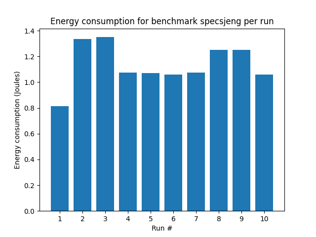

# This repo serves as the report and codebase for Lab 3/3 for the Advanced Computer Architecture course, on the Electrical and Computer Engineering school of Aristotle University of Thessaloniki

Ανδρονίκου Δημήτρης, 9836

Αλεξανδρίδης Φώτιος, 9953

---
## Advaced Computer Architecture, Lab 03

### Question 1

We execute “./mcpat -infile ProcessorDescriptionFiles/Xeon.xml -print\_level 1 “

The results are:

McPAT (version 1.3 of Feb, 2015) results (current print level is 1, please increase print level to see the details in components): 

\*\*\*\*\*\*\*\*\*\*\*\*\*\*\*\*\*\*\*\*\*\*\*\*\*\*\*\*\*\*\*\*\*\*\*\*\*\*\*\*\*\*\*\*\*\*\*\*\*\*\*\*\*\*\*\*\*\*\*\*\*\*\*\*\*\*\*\*\*\*\*\*\*\*\*\*\*\*\*\*\*\*\*\*\*\*\*\*\*

`  `Technology 65 nm

`  `Using Long Channel Devices When Appropriate

`  `Interconnect metal projection= aggressive interconnect technology projection

`  `Core clock Rate(MHz) 3400

\*\*\*\*\*\*\*\*\*\*\*\*\*\*\*\*\*\*\*\*\*\*\*\*\*\*\*\*\*\*\*\*\*\*\*\*\*\*\*\*\*\*\*\*\*\*\*\*\*\*\*\*\*\*\*\*\*\*\*\*\*\*\*\*\*\*\*\*\*\*\*\*\*\*\*\*\*\*\*\*\*\*\*\*\*\*\*\*\*

**Processor:** 

`  `Area = 410.507 mm^2

`  `Peak Power = 134.938 W

`  `Total Leakage = 36.8319 W

`  `Peak Dynamic = 98.1063 W

`  `Subthreshold Leakage = 35.1632 W

`  `Subthreshold Leakage with power gating = 16.3977 W

`  `Gate Leakage = 1.66871 W

`  `Runtime Dynamic = 72.9199 W

`  `**Total Cores: 2 cores** 

`  `Device Type= ITRS high performance device type

`    `Area = 111.713 mm^2

`    `Peak Dynamic = 78.5978 W

`    `Subthreshold Leakage = 24.1131 W

`    `Subthreshold Leakage with power gating = 10.3006 W

`    `Gate Leakage = 1.49026 W

`    `Runtime Dynamic = 55.7891 W

`  `**Total L3s:** 

`  `Device Type= ITRS high performance device type

`    `Area = 293.281 mm^2

`    `Peak Dynamic = 6.70159 W

`    `Subthreshold Leakage = 10.9824 W

`    `Subthreshold Leakage with power gating = 6.06659 W

`    `Gate Leakage = 0.165767 W

`    `Runtime Dynamic = 4.32382 W

`  `**Total NoCs (Network/Bus):** 

`  `Device Type= ITRS high performance device type

`    `Area = 5.51364 mm^2

`    `Peak Dynamic = 12.807 W

`    `Subthreshold Leakage = 0.0678232 W

`    `Subthreshold Leakage with power gating = 0.0305204 W

`    `Gate Leakage = 0.0126787 W

`    `Runtime Dynamic = 12.807 W

#### 1st
Dynamic power is the power of transistors which change their value (on/ off) . It is also known as Switching Power

And is PDynamic = a \* C \* f \* Vdd^2

Leakage or Static Power is the power which is due to leakage current of transistors. It is consumed even when transistors are off and is proportional to the number of transistors. 

And is PLeakage  =  ( Isub + Ig ) \* Vdd

So if we run different programs in a specific CPU only Dynamic power will be affected.

Time will affect only the total energy used not the power.
#### 2nd 
Yes it is possible that the second cpu ***maybe*** would be more energy efficient, that’s because cpu is a part of a system, which also consumes energy. So if we use a faster cpu (if 50 W cpu is faster) then the rest of the system could fall into sleep mode and save energy (that’s the race- to -halt strategy). Also a faster cpu probably would have less execution time and as we know Energy is Power \* Time, so again ***maybe*** could consume less energy. On the other hand, we should take into account the Leakage power. For example if Leakage power is 80% of total power for the faster cpu, ***maybe*** it would be meaningless to consider if it is more energy efficient than the slower cpu (again this depends on execution time).

McPAT gives us details about Core, Memory and NOC but doesn’t give any datails about execution time. So, to answer this we would also need to use the gem5.

#### 3rd 
We execute  “./mcpat -infile ProcessorDescriptionFiles/ARM\_A9\_@GHz.xml -print\_level 1”

The results are:

McPAT (version 1.3 of Feb, 2015) results (current print level is 1, please increase print level to see the details in components): 

\*\*\*\*\*\*\*\*\*\*\*\*\*\*\*\*\*\*\*\*\*\*\*\*\*\*\*\*\*\*\*\*\*\*\*\*\*\*\*\*\*\*\*\*\*\*\*\*\*\*\*\*\*\*\*\*\*\*\*\*\*\*\*\*\*\*\*\*\*\*\*\*\*\*\*\*\*\*\*\*\*\*\*\*\*\*\*\*\*

`  `Technology 40 nm

`  `Using Long Channel Devices When Appropriate

`  `Interconnect metal projection= conservative interconnect technology projection

`  `Core clock Rate(MHz) 2000

\*\*\*\*\*\*\*\*\*\*\*\*\*\*\*\*\*\*\*\*\*\*\*\*\*\*\*\*\*\*\*\*\*\*\*\*\*\*\*\*\*\*\*\*\*\*\*\*\*\*\*\*\*\*\*\*\*\*\*\*\*\*\*\*\*\*\*\*\*\*\*\*\*\*\*\*\*\*\*\*\*\*\*\*\*\*\*\*\*

Processor: 

`  `Area = 5.39698 mm^2

`  `Peak Power = 1.74189 W

`  `Total Leakage = 0.108687 W

`  `Peak Dynamic = 1.6332 W

`  `Subthreshold Leakage = 0.0523094 W

`  `Gate Leakage = 0.0563774 W

`  `Runtime Dynamic = 2.96053 W

`  `Total Cores: 2 cores 

`  `Device Type= ITRS low operating power device type

`    `Area = 4.84735 mm^2

`    `Peak Dynamic = 1.57159 W

`    `Subthreshold Leakage = 0.0484486 W

`    `Gate Leakage = 0.0501375 W

`    `Runtime Dynamic = 1.06575 W

`  `Total First Level Directory: 

`  `Device Type= ITRS low operating power device type

`    `Area = 0.535391 mm^2

`    `Peak Dynamic = 0.045212 W

`    `Subthreshold Leakage = 0.00370577 W

`    `Gate Leakage = 0.0060234 W

`    `Runtime Dynamic = 1.81276 W

`  `Total NoCs (Network/Bus): 

`  `Device Type= ITRS low operating power device type

`    `Area = 0.014239 mm^2

`    `Peak Dynamic = 0.0164048 W

`    `Subthreshold Leakage = 0.000155022 W

`    `Gate Leakage = 0.000216526 W

`    `Runtime Dynamic = 0.0820239 W

So we assume that Xeon runs x50 faster than Arm a9, that means that if the execution time in arm is T then the execution time in Xeon is 0,02\*T. 

In T time the total energy of Xeon would be

0.02 *T \* Runtime Dynamic (= 72.9199 W)  +  T\* Total Leakage  (= 36.8319 W) = 38.2903\*T  Joule

In T time the total energy of Arm would be

T \*Runtime Dynamic (= 2.96053 W) + T\*  Total Leakage  (= 0.108687 W) = 3.069217\*T  Joule

So ARM till T time is more energy efficient than Xeon.

And after the T time the leakage power of Xeon will be always grater than the leakage power of ARM

So Xeon will never be more energy efficient than ARM.

### Question 2

So our run tests are these:

|Run #|L1 dcache size|L1 icache size|L2 cache size|L1 icache associat.|L1 dcache associat.|L2 cache associat.|Cache line size|
| :- | :- | :- | :- | :- | :- | :- | :- |
|1|64|64|1|1|1|2|128|
|2|64|128|2|1|1|2|32|
|3|128|64|2|1|1|2|32|
|4|128|128|4|1|1|2|128|
|5|128|128|4|2|1|2|128|
|6|128|128|4|4|1|2|128|
|7|128|128|4|4|2|2|128|
|8|128|128|4|4|4|2|64|
|9|128|128|4|4|4|4|64|
|10|128|128|4|4|4|8|128|

#### Subquestion 1
The total product we wish to calculate is the EDAP (Energy-Delay-Area-Product) and to do it for a configuration we can use the following type:

`EDAP = Energy * Delay * Area`

where:
- `Energy` is the total energy for that configuration, equal to (Core:Subthreshold Leakage + Core:Gate Leakage Core:Runtime Dynamic + L2:Subthreshold Leakage + L2:Gate Leakage L2:Runtime Dynamic) *time
- `Area` is the total area, equal to Core:Area and L2:Area
- `Delay` is the program execution time, obtained from the `gem5` runs (`stats.txt`, `sim_seconds`)

#### Subquestion 2

Tables for the plots provided above are the following:

Benchmark: specbzip
| Run # | Energy Consumtion(J) | Peak Power(W) |
| --- | --- | --- |
| 1 | 0.30285458610495003 | 9.27139 |
| 2 | 0.218996852585832 | 2.82349 |
| 3 | 0.220595439833725 | 2.81092 |
| 4 | 0.4015489756584 | 11.2387 |
| 5 | 0.39965751907450997 | 11.2773 |
| 6 | 0.40011697230959997 | 11.2481 |
| 7 | 0.39757625617830006 | 11.3389 |
| 8 | 0.3172382513115199 | 5.59558 |
| 9 | 0.3171147204564 | 5.59718 |
| 10 | 0.3924253123746 | 11.2832 |

Benchmark: spechmmer
| Run # | Energy Consumtion(J) | Peak Power(W) |
| --- | --- | --- |
| 1 | 0.22345305542482002 | 9.27139 |
| 2 | 0.15688263617298998 | 2.82349 |
| 3 | 0.159383369234269 | 2.81092 |
| 4 | 0.3082506761122 | 11.2387 |
| 5 | 0.30667627008809 | 11.2773 |
| 6 | 0.30701635776518 | 11.2481 |
| 7 | 0.30817478659930003 | 11.3389 |
| 8 | 0.24682346641238395 | 5.59558 |
| 9 | 0.246834497926235 | 5.59718 |
| 10 | 0.30596914763137006 | 11.2832 |

Benchmark: speclibm
| Run # | Energy Consumtion(J) | Peak Power(W) |
| --- | --- | --- |
| 1 | 0.34353211971923003 | 9.27139 |
| 2 | 0.46048822207422396 | 2.82349 |
| 3 | 0.46610032326365197 | 2.81092 |
| 4 | 0.4628610209695999 | 11.2387 |
| 5 | 0.46048824072152006 | 11.2773 |
| 6 | 0.46106906893649996 | 11.2481 |
| 7 | 0.46389779251200003 | 11.3389 |
| 8 | 0.4897978746093499 | 5.59558 |
| 9 | 0.4898813438573 | 5.59718 |
| 10 | 0.46055267349504003 | 11.2832 |

Benchmark: specmcf
| Run # | Energy Consumtion(J) | Peak Power(W) |
| --- | --- | --- |
| 1 | 0.20010851446812 | 9.27139 |
| 2 | 0.14856534818794898 | 2.82349 |
| 3 | 0.152333457223221 | 2.81092 |
| 4 | 0.27544601332097995 | 11.2387 |
| 5 | 0.27412063519635 | 11.2773 |
| 6 | 0.27428253249621 | 11.2481 |
| 7 | 0.27799153495605 | 11.3389 |
| 8 | 0.23167027379423996 | 5.59558 |
| 9 | 0.23168100567945601 | 5.59718 |
| 10 | 0.2748777265624 | 11.2832 |

Benchmark: specsjeng
| Run # | Energy Consumtion(J) | Peak Power(W) |
| --- | --- | --- |
| 1 | 0.81260085796977 | 9.27139 |
| 2 | 1.33620154607268 | 2.82349 |
| 3 | 1.3494040654503918 | 2.81092 |
| 4 | 1.0748223102357 | 11.2387 |
| 5 | 1.0688679640115097 | 11.2773 |
| 6 | 1.0589635000854 | 11.2481 |
| 7 | 1.0755156718830001 | 11.3389 |
| 8 | 1.2513822278959998 | 5.59558 |
| 9 | 1.2515938090314997 | 5.59718 |
| 10 | 1.06034462982528 | 11.2832 |

#### Subquestion 3
If we could combine different elements from architectures to create the ideal CPU Architecture, we would need a criterion to decide on which one is the best. We can use two metrics we have already created in this and in the previous lab: the EDAP and our custom Cost CPI function from lab 2. The Cost function showed that the configuration in run 1 is the best. By comparing the EDAP values for every run for every benchmark, we can determine the optimal architecture. By looking at the tables below:

Benchmark: specbzip
| Run # | EDAP |
| --- | --- |
| 1 | 9.327133830108588 |
| 2 | 3.039652224237564 |
| 3 | 3.088106738414723 |
| 4 | 14.55382138355818 |
| 5 | 14.299026648951632 |
| 6 | 14.332670088496641 |
| 7 | 14.037860998897125 |
| 8 | 9.421436758924912 |
| 9 | 9.509255699381976 |
| 10 | 13.470077332320617 |

Benchmark: spechmmer
| Run # | EDAP |
| --- | --- |
| 1 | 6.8817731291403526 |
| 2 | 2.177513732991122 |
| 3 | 2.2312014105757623 |
| 4 | 11.172299155145797 |
| 5 | 10.972324926465701 |
| 6 | 10.997694354778064 |
| 7 | 10.881220270120044 |
| 8 | 7.330237352554903 |
| 9 | 7.401776722414424 |
| 10 | 10.502452186276303 |

Benchmark: speclibm
| Run # | EDAP |
| --- | --- |
| 1 | 10.579896103841016 |
| 2 | 6.3915258686858 |
| 3 | 6.524919781354933 |
| 4 | 16.776027416226373 |
| 5 | 16.47544037418269 |
| 6 | 16.51604733218815 |
| 7 | 16.379581596689203 |
| 8 | 14.546164219510858 |
| 9 | 14.689973881980084 |
| 10 | 15.808562628251947 |

Benchmark: specmcf
| Run # | EDAP |
| --- | --- |
| 1 | 6.162821963480479 |
| 2 | 2.062070690660431 |
| 3 | 2.132509974329582 |
| 4 | 9.983320396008262 |
| 5 | 9.807542910182049 |
| 6 | 9.825129453053236 |
| 7 | 9.815491911149186 |
| 8 | 6.880213292223478 |
| 9 | 6.947371981108712 |
| 10 | 9.435232939799691 |

Benchmark: specsjeng
| Run # | EDAP |
| --- | --- |
| 1 | 25.025993663238193 |
| 2 | 18.54633047731873 |
| 3 | 18.890253536077417 |
| 4 | 38.956074776644755 |
| 5 | 38.2421717899966 |
| 6 | 37.93334332925913 |
| 7 | 37.9749526522481 |
| 8 | 37.16392481872378 |
| 9 | 37.53129323266578 |
| 10 | 36.3965414876787 |

we can conclude that the best configuration is that of run 2. Of course, there are many more possible criteria that can influence our choice (the cost or energy consumption might not be as important as the need for high performance)

So we will chose the MinorCPU architecture with the configuration mentioned.

Reminder that these runs and their respective specs can be found on the report from the previous lab and are not presented in this report.

#### Possible faults in the procedure
As always, with software simulations there is a degree of error because it is not possible to simulate the system in question 100% accurately. Furthermore, the systems in which this research is conducted are not optimized for simulations. Plus, we use two different programs to conduct our research, which have not been developed with the intention of being used together, thus having possible differences in their code and the way they handle things/results. 

An example of something that cannot be simulated properly is the effect of the generated heat from a CPU, how it can cause thermal throttling depending on the cooling/temperature system configuration or speed up the actions performed by the integrated circuit.

#### Our opinion 

The only difficult part was to re-run part2 because some tests of the part 2 were executed on mac which uses different names on results. In general we think it was an easy part of project.

#### Bibliography

https://www.gatevidyalay.com/cache-line-cache-line-size-cache-memory/

http://ece-research.unm.edu/jimp/611/slides/chap5_4.html

Computer Architecture John L. Hennesy and A. Patterson, 4th edition

Digital Intergrated Circuits, 2nd edition

