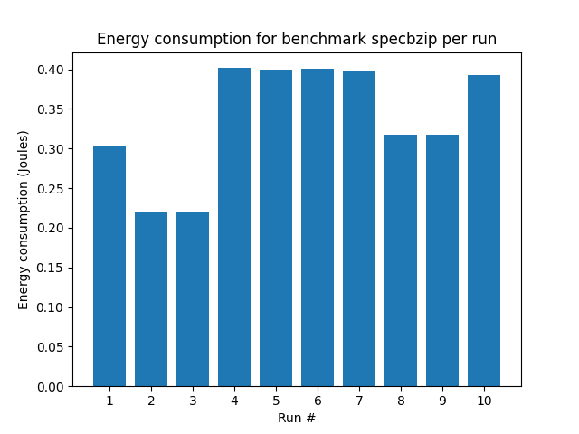

# This repo serves as the report and codebase for Lab 3/3 for the Advanced Computer Architecture course, on the Electrical and Computer Engineering school of Aristotle University of Thessaloniki

Ανδρονίκου Δημήτρης, 9836

Αλεξανδρίδης Φώτιος, 9953

---
## Advaced Computer Architecture, Lab 03

### Question 2

#### Subquestion 1
The total product we wish to calculate is the EDAP (Energy-Delay-Area-Product) and to do it for a configuration we can use the following type:

`EDAP = Energy * Delay * Area`

where:
- `Energy` is the total energy for that configuration, equal to Core:Subthreshold Leakage + Core:Gate Leakage Core:Runtime Dynamic + L2:Subthreshold Leakage + L2:Gate Leakage L2:Runtime Dynamic
- `Area` is the total area, equal to Core:Area and L2:Area
- `Delay` is the program execution time, obtained from the `gem5` runs (`stats.txt`, `sim_seconds`)

#### Subquestion 2

#### Subquestion 3
If we could combine different elements from architectures to create the ideal CPU Architecture, we would need a criterion to decide on which one is the best. We can use two metrics we have already created in this and in the previous lab: the EDAP and our custom Cost CPI function from lab 2. The Cost function showed that the configuration in run 1 is the best. By comparing the EDAP values for every run for every benchmark, we can determine the optimal architecture. By looking at the tables below:

Benchmark: specbzip
| Run # | EDAP |
| --- | --- |
| 1 | 9.327133830108588 |
| --- | --- |
| 2 | 3.039652224237564 |
| --- | --- |
| 3 | 3.088106738414723 |
| --- | --- |
| 4 | 14.55382138355818 |
| --- | --- |
| 5 | 14.299026648951632 |
| --- | --- |
| 6 | 14.332670088496641 |
| --- | --- |
| 7 | 14.037860998897125 |
| --- | --- |
| 8 | 9.421436758924912 |
| --- | --- |
| 9 | 9.509255699381976 |
| --- | --- |
| 10 | 13.470077332320617 |
| --- | --- |

Benchmark: spechmmer
| Run # | EDAP |
| --- | --- |
| 1 | 6.8817731291403526 |
| --- | --- |
| 2 | 2.177513732991122 |
| --- | --- |
| 3 | 2.2312014105757623 |
| --- | --- |
| 4 | 11.172299155145797 |
| --- | --- |
| 5 | 10.972324926465701 |
| --- | --- |
| 6 | 10.997694354778064 |
| --- | --- |
| 7 | 10.881220270120044 |
| --- | --- |
| 8 | 7.330237352554903 |
| --- | --- |
| 9 | 7.401776722414424 |
| --- | --- |
| 10 | 10.502452186276303 |
| --- | --- |

Benchmark: speclibm
| Run # | EDAP |
| --- | --- |
| 1 | 10.579896103841016 |
| --- | --- |
| 2 | 6.3915258686858 |
| --- | --- |
| 3 | 6.524919781354933 |
| --- | --- |
| 4 | 16.776027416226373 |
| --- | --- |
| 5 | 16.47544037418269 |
| --- | --- |
| 6 | 16.51604733218815 |
| --- | --- |
| 7 | 16.379581596689203 |
| --- | --- |
| 8 | 14.546164219510858 |
| --- | --- |
| 9 | 14.689973881980084 |
| --- | --- |
| 10 | 15.808562628251947 |
| --- | --- |

Benchmark: specmcf
| Run # | EDAP |
| --- | --- |
| 1 | 6.162821963480479 |
| --- | --- |
| 2 | 2.062070690660431 |
| --- | --- |
| 3 | 2.132509974329582 |
| --- | --- |
| 4 | 9.983320396008262 |
| --- | --- |
| 5 | 9.807542910182049 |
| --- | --- |
| 6 | 9.825129453053236 |
| --- | --- |
| 7 | 9.815491911149186 |
| --- | --- |
| 8 | 6.880213292223478 |
| --- | --- |
| 9 | 6.947371981108712 |
| --- | --- |
| 10 | 9.435232939799691 |
| --- | --- |

Benchmark: specsjeng
| Run # | EDAP |
| --- | --- |
| 1 | 25.025993663238193 |
| --- | --- |
| 2 | 18.54633047731873 |
| --- | --- |
| 3 | 18.890253536077417 |
| --- | --- |
| 4 | 38.956074776644755 |
| --- | --- |
| 5 | 38.2421717899966 |
| --- | --- |
| 6 | 37.93334332925913 |
| --- | --- |
| 7 | 37.9749526522481 |
| --- | --- |
| 8 | 37.16392481872378 |
| --- | --- |
| 9 | 37.53129323266578 |
| --- | --- |
| 10 | 36.3965414876787 |
| --- | --- |

we can conclude that the best configuration is that of run 2. Of course, there are many more possible criteria that can influence our choice (the cost or energy consumption might not be as important as the need for high performance)
Reminder that these runs and their respective specs can be found on the report from the previous lab and are not presented in this report.

#### Possible faults in the procedure
As always, with software simulations there is a degree of error because it is not possible to simulate the system in question 100% accurately. Furthermore, the systems in which this research is conducted are not optimized for simulations. Plus, we use two different programs to conduct our research, which have not been developed with the intention of being used together, thus having possible differences in their code and the way they handle things/results. 

An example of something that cannot be simulated properly is the effect of the generated heat from a CPU, how it can cause thermal throttling depending on the cooling/temperature system configuration or speed up the actions performed by the integrated circuit.
